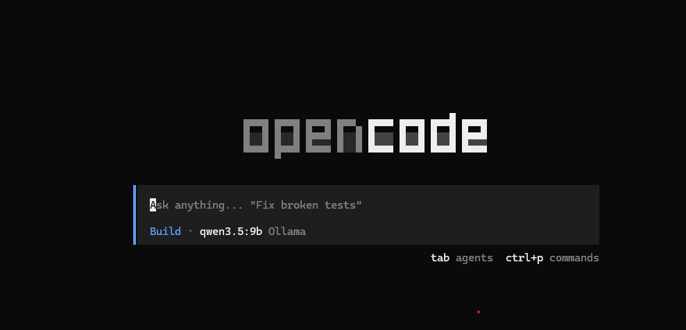

# 03 Code Assistant

Module này hướng dẫn cách dùng AI để:

- đọc source code Angular
- hiểu cấu trúc dự án
- xác định business logic
- tìm file quan trọng
- chuẩn bị cho bước migrate sau này

Project hiện tại:

```text
YOUR_LOCAL_DIRECTORY_CODE
D:\MyProjects\ConvertCode\web-admin
```

---

# Mục tiêu của bước này

Ở bước này model cần:

- hiểu cấu trúc project
- hiểu folder
- hiểu service
- hiểu routing
- hiểu module
- chưa viết code ngay

Mục tiêu chính:
```text
Cho AI học project trước khi ra lệnh sửa code
```

---

# Bước 1 — Mở terminal tại thư mục dự án

Mở CMD hoặc PowerShell:

```bash
cd /d YOUR_LOCAL_DIRECTORY_CODE
cd /d D:\MyProjects\ConvertCode\web-admin
```

Kiểm tra thư mục:

```bash
dir
```

Bạn cần thấy:

```text
src
package.json
angular.json
tsconfig.json
```

---

# Bước 2 — Khởi chạy coding agent

Khuyến nghị:

```bash
ollama launch opencode
```

Hoặc:

```bash
ollama launch codex
```

Mục đích:
- cho AI truy cập source
- hiểu project
- phân tích file

Sau khi chạy lệnh, coding agent sẽ được khởi động và hiển thị như sau:



# Bước 3 — Yêu cầu AI học project trước

Prompt đầu tiên:

```text
You are a senior Angular architect.

First:
- analyze this Angular project
- understand folder structure
- understand coding style
- understand services
- understand routing
- understand shared modules

Do not generate code yet.
Explain the project architecture first.
```

---

# Bước 4 — Yêu cầu AI liệt kê module quan trọng

Prompt:

```text
List the important modules in this project.
Explain:
- authentication
- shared components
- API services
- routing
- guards
- business modules
```

Mục tiêu:
AI xác định:
- file quan trọng
- logic chính
- module chính

---

# Bước 5 — Tìm nơi xử lý API

Prompt:

```text
Which files handle API communication in this project?
```

Hoặc:

```text
Show me where HTTP requests are implemented.
```

Mục tiêu:
xác định:
- service layer
- interceptor
- token handling

---

# Bước 6 — Tìm luồng đăng nhập

Prompt:

```text
Explain the login flow in this Angular project step by step.
```

AI sẽ giúp bạn hiểu:
- login component
- auth service
- token storage
- route guard

---

# Bước 7 — Tìm component nên chuyển trước

Prompt:

```text
Which component should be migrated first with the lowest risk?
```

AI thường chọn:
- component nhỏ
- ít dependency
- dễ test

Ví dụ:
- login
- form nhỏ
- table nhỏ

---

# Bước 8 — Cho AI học một component cụ thể

Ví dụ:

```text
src/app/modules/user/user.component.ts
src/app/modules/user/user.component.html
```

Prompt:

```text
Read this component carefully.
Explain:
- purpose
- inputs
- outputs
- API calls
- validation
- dependencies

Do not convert it yet.
```

---

# Bước 9 — Học coding style của project

Prompt:

```text
Study the coding style of this project.

Focus on:
- naming convention
- folder structure
- service pattern
- component pattern

Use the same style for future code.
```

Mục tiêu:
để model viết code giống dự án hiện tại

---

# Bước 10 — Kiểm tra model đã hiểu chưa

Prompt:

```text
Summarize your understanding of this project.
```

Nếu AI trả lời đúng:
- module
- service
- flow
- logic

=> model đã hiểu project

---

# Bước 11 — Lưu context trước khi code

Prompt:

```text
Remember this architecture.
Wait for the next instruction before generating code.
```

Điều này giúp:
- model không viết lung tung
- giữ context tốt hơn

---

# Những điều không nên làm

Không nên:

```text
Convert the whole project now.
```

Vì:
- project quá lớn
- model mất context
- dễ sai logic

---

# Cách đúng

Nên:

```text
Learn first.
Convert later.
One component at a time.
```

---

# Prompt tốt nhất để học project

```text
You are a senior frontend engineer.

First understand this Angular project.

Analyze:
- architecture
- modules
- routing
- services
- coding style

Do not generate code.
Explain your understanding only.
```

---

# Kết quả mong muốn

Sau bước này AI sẽ hiểu:

- project structure
- business flow
- coding convention
- migration order

Từ đó bước sau mới:
```text
Convert to React safely.
```

---

# Quy trình đúng

```text
Open project
→ Launch AI
→ Analyze project
→ Learn architecture
→ Learn component
→ Confirm understanding
→ Then convert
```

---

# Kết luận

Tại bước này chỉ làm:

```text
Cho AI học code dự án
```

Chưa nên:

```text
Chuyển React ngay
```

để tránh sai kiến trúc.